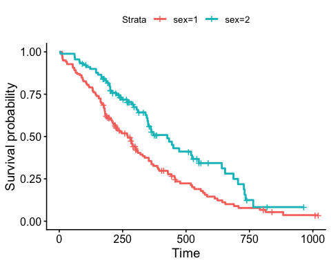
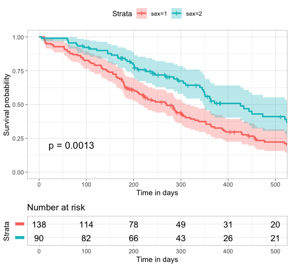
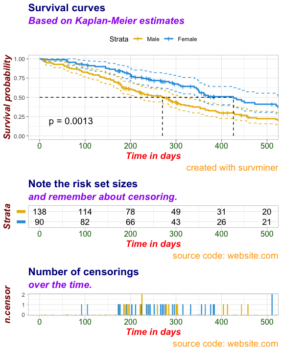

[](https://github.com/kassambara/survminer/actions/workflows/R-CMD-check.yaml)
[](https://cran.r-project.org/package=survminer)
[](https://cran.r-project.org/package=survminer)
[](https://cran.r-project.org/package=survminer)

<br/>

-   [survminer: Survival Analysis and
    Visualization](#survminer-survival-analysis-and-visualization)
    -   [Installation and loading](#installation-and-loading)
    -   [ggsurvplot: Drawing survival
        curves](#ggsurvplot-drawing-survival-curves)
        -   [Fitting survival curves](#fitting-survival-curves)
        -   [Basic plots](#basic-plots)
        -   [Computing and passing
            p-values](#computing-and-passin-p-values)
        -   [Customized survival curves](#customized-survival-curves)
        -   [More customized survival
            curves](#more-customized-survival-curves)
        -   [Uber customized survival
            curves](#uber-customized-survival-curves)
        -   [Uber platinum customized survival
            curves](#uber-platinum-customized-survival-curves)
        -   [Uber platinum premium customized survival
            curves](#uber-platinum-premium-customized-survival-curves)
    -   [Blog posts](#blog-posts)

# survminer: Survival Analysis and Visualization

The **survminer** R package provides functions for facilitating
**survival analysis** and **visualization**.

The main functions, in the package, are organized in different
categories as follow.

**Survival Curves**
<hr/>

<br/>

-   **ggsurvplot**(): Draws survival curves with the ‘number at risk’
    table, the cumulative number of events table and the cumulative
    number of censored subjects table.

-   **arrange_ggsurvplots**(): Arranges multiple ggsurvplots on the same
    page.

-   **ggsurvevents**(): Plots the distribution of event’s times.

-   **surv_summary**(): Summary of a survival curve. Compared to the
    default summary() function, surv_summary() creates a data frame
    containing a nice summary from survfit results.

-   **surv_cutpoint**(): Determines the optimal cutpoint for one or
    multiple continuous variables at once. Provides a value of a
    cutpoint that correspond to the most significant relation with
    survival.

-   **pairwise_survdiff**(): Multiple comparisons of survival curves.
    Calculate pairwise comparisons between group levels with corrections
    for multiple testing.

<br/>

**Diagnostics of Cox Model**
<hr/>

<br/>

-   **ggcoxzph**(): Graphical test of proportional hazards. Displays a
    graph of the scaled Schoenfeld residuals, along with a smooth curve
    using ggplot2. Wrapper around plot.cox.zph().

-   **ggcoxdiagnostics**(): Displays diagnostics graphs presenting
    goodness of Cox Proportional Hazards Model fit.

-   **ggcoxfunctional**(): Displays graphs of continuous explanatory
    variable against martingale residuals of null cox proportional
    hazards model. It helps to properly choose the functional form of
    continuous variable in cox model.

<br/>

**Summary of Cox Model**
<hr/>

<br/>

-   **ggforest**(): Draws forest plot for CoxPH model.

-   **ggcoxadjustedcurves**(): Plots adjusted survival curves for coxph
    model.

<br/>

**Competing Risks**
<hr/>

<br/>

-   **ggcompetingrisks**(): Plots cumulative incidence curves for
    competing risks.

<br/>

> Find out more at <https://rpkgs.datanovia.com/survminer/>, and check
> out the documentation and usage examples of each of the functions in
> survminer package.

## Installation and loading

Install from [CRAN](https://cran.r-project.org/package=survminer) as
follow:

``` r
install.packages("survminer")
```

Or, install the latest version from
[GitHub](https://github.com/kassambara/survminer):

``` r
if(!require(devtools)) install.packages("devtools")
devtools::install_github("kassambara/survminer", build_vignettes = FALSE)
```

Load survminer:

``` r
library("survminer")
```

## ggsurvplot: Drawing survival curves

### Fitting survival curves

``` r
require("survival")
fit <- survfit(Surv(time, status) ~ sex, data = lung)
```

### Basic plots

``` r
ggsurvplot(fit, data = lung)
```



Censor shape can be changed as follow:

``` r
ggsurvplot(fit, data = lung, censor.shape="|", censor.size = 4)
```

### Customized survival curves

``` r
ggsurvplot(
  fit, 
  data = lung, 
  size = 1,                 # change line size
  palette = 
    c("#E7B800", "#2E9FDF"),# custom color palettes
  conf.int = TRUE,          # Add confidence interval
  pval = TRUE,              # Add p-value
  risk.table = TRUE,        # Add risk table
  risk.table.col = "strata",# Risk table color by groups
  legend.labs = 
    c("Male", "Female"),    # Change legend labels
  risk.table.height = 0.25, # Useful to change when you have multiple groups
  ggtheme = theme_bw()      # Change ggplot2 theme
)
```


Note that, additional arguments are available to customize the main
title, axis labels, the font style, axis limits, legends and the number
at risk table.

### More customized survival curves

Focus on `xlim` and `break.time.by` parameters which do not change the
calculations of estimates of survival surves. Also note
`risk.table.y.text.col = TRUE` and `risk.table.y.text = FALSE` that
provide bars instead of names in text annotations of the legend of risk
table.

``` r
ggsurvplot(
   fit,                     # survfit object with calculated statistics.
   data = lung,             # data used to fit survival curves.
   risk.table = TRUE,       # show risk table.
   pval = TRUE,             # show p-value of log-rank test.
   conf.int = TRUE,         # show confidence intervals for 
                            # point estimates of survival curves.
   xlim = c(0,500),         # present narrower X axis, but not affect
                            # survival estimates.
   xlab = "Time in days",   # customize X axis label.
   break.time.by = 100,     # break X axis in time intervals by 500.
   ggtheme = theme_light(), # customize plot and risk table with a theme.
 risk.table.y.text.col = T, # colour risk table text annotations.
  risk.table.y.text = FALSE # show bars instead of names in text annotations
                            # in legend of risk table
)
```



### Uber customized survival curves

``` r
ggsurv <- ggsurvplot(
           fit,                     # survfit object with calculated statistics.
           data = lung,             # data used to fit survival curves.
           risk.table = TRUE,       # show risk table.
           pval = TRUE,             # show p-value of log-rank test.
           conf.int = TRUE,         # show confidence intervals for 
                                    # point estimates of survival curves.
           palette = c("#E7B800", "#2E9FDF"),
           xlim = c(0,500),         # present narrower X axis, but not affect
                                    # survival estimates.
           xlab = "Time in days",   # customize X axis label.
           break.time.by = 100,     # break X axis in time intervals by 500.
           ggtheme = theme_light(), # customize plot and risk table with a theme.
          risk.table.y.text.col = T,# colour risk table text annotations.
          risk.table.height = 0.25, # the height of the risk table
          risk.table.y.text = FALSE,# show bars instead of names in text annotations
                                    # in legend of risk table.
          ncensor.plot = TRUE,      # plot the number of censored subjects at time t
          ncensor.plot.height = 0.25,
          conf.int.style = "step",  # customize style of confidence intervals
          surv.median.line = "hv",  # add the median survival pointer.
          legend.labs = 
            c("Male", "Female")    # change legend labels.
        )
ggsurv
```


### Uber platinum customized survival curves

Helper function to customize plot labels:

``` r
customize_labels <- function (p, font.title = NULL,
                              font.subtitle = NULL, font.caption = NULL,
                              font.x = NULL, font.y = NULL, font.xtickslab = NULL, font.ytickslab = NULL)
{
  original.p <- p
  if(is.ggplot(original.p)) list.plots <- list(original.p)
  else if(is.list(original.p)) list.plots <- original.p
  else stop("Can't handle an object of class ", class (original.p))
  .set_font <- function(font){
    font <- ggpubr:::.parse_font(font)
    ggtext::element_markdown (size = font$size, face = font$face, colour = font$color)
  }
  for(i in 1:length(list.plots)){
    p <- list.plots[[i]]
    if(is.ggplot(p)){
      if (!is.null(font.title)) p <- p + theme(plot.title = .set_font(font.title))
      if (!is.null(font.subtitle)) p <- p + theme(plot.subtitle = .set_font(font.subtitle))
      if (!is.null(font.caption)) p <- p + theme(plot.caption = .set_font(font.caption))
      if (!is.null(font.x)) p <- p + theme(axis.title.x = .set_font(font.x))
      if (!is.null(font.y)) p <- p + theme(axis.title.y = .set_font(font.y))
      if (!is.null(font.xtickslab)) p <- p + theme(axis.text.x = .set_font(font.xtickslab))
      if (!is.null(font.ytickslab)) p <- p + theme(axis.text.y = .set_font(font.ytickslab))
      list.plots[[i]] <- p
    }
  }
  if(is.ggplot(original.p)) list.plots[[1]]
  else list.plots
}
```

Customized plot labels:

``` r
# Changing Labels
# %%%%%%%%%%%%%%%%%%%%%%%%%%
# Labels for Survival Curves (plot)
ggsurv$plot <- ggsurv$plot + labs(
  title    = "Survival curves",                     
  subtitle = "Based on Kaplan-Meier estimates",  
  caption  = "created with survminer"             
  )

# Labels for Risk Table 
ggsurv$table <- ggsurv$table + labs(
  title    = "Note the risk set sizes",          
  subtitle = "and remember about censoring.", 
  caption  = "source code: website.com"        
  )

# Labels for ncensor plot 
ggsurv$ncensor.plot <- ggsurv$ncensor.plot + labs( 
  title    = "Number of censorings", 
  subtitle = "over the time.",
  caption  = "source code: website.com"
  )

# Changing the font size, style and color
# %%%%%%%%%%%%%%%%%%%%%%%%%%%%%%%%%%%%%%%
# Applying the same font style to all the components of ggsurv:
# survival curves, risk table and censor part

ggsurv <- customize_labels(
  ggsurv,
  font.title    = c(16, "bold", "darkblue"),         
  font.subtitle = c(15, "bold.italic", "purple"), 
  font.caption  = c(14, "plain", "orange"),        
  font.x        = c(14, "bold.italic", "red"),          
  font.y        = c(14, "bold.italic", "darkred"),      
  font.xtickslab = c(12, "plain", "darkgreen")
)

ggsurv
```



## Uber platinum premium customized survival curves

``` r
# Using specific fonts for risk table and ncensor plots
#%%%%%%%%%%%%%%%%%%%%%%%%%%%%%%%%%%%%%%%%%%%%%%%%%%%%%%%%%%%
# Font for Risk Table
ggsurv$table <- customize_labels(
  ggsurv$table,
  font.title    = c(13, "bold.italic", "green"),
  font.subtitle = c(15, "bold", "pink"),
  font.caption  = c(11, "plain", "darkgreen"),
  font.x        = c(8, "bold.italic", "orange"),
  font.y        = c(11, "bold.italic", "darkgreen"),
  font.xtickslab = c(9, "bold", "red")
)


# Font for ncensor plot
ggsurv$ncensor.plot <- customize_labels(
  ggsurv$ncensor.plot,
  font.title    = c(13, "bold.italic", "green"),
  font.subtitle = c(15, "bold", "pink"),
  font.caption  = c(11, "plain", "darkgreen"),
  font.x        = c(8, "bold.italic", "orange"),
  font.y        = c(11, "bold.italic", "darkgreen"),
  font.xtickslab = c(9, "bold", "red")
)

print(ggsurv)
```


## Blog posts

-   M. Kosiński. January 2017. [Weighted Log-rank
    Tests](https://rpkgs.datanovia.com/survminer/articles/Specifiying_weights_in_log-rank_comparisons.html)

-   A. Kassambara. STHDA December 2016. [Survival Analysis Basics:
    Curves and Logrank
    Tests](http://www.sthda.com/english/wiki/survival-analysis-basics)

-   A. Kassambara. STHDA December 2016. [Cox Proportional Hazards
    Model](http://www.sthda.com/english/wiki/cox-proportional-hazards-model)

-   A. Kassambara. STHDA December 2016. [Cox Model
    Assumptions](http://www.sthda.com/english/wiki/cox-model-assumptions)

-   M. Kosiński. May 2016. [Survival plots have never been so
    informative](https://rpkgs.datanovia.com/survminer/articles/Informative_Survival_Plots.html)

-   A. Kassambara. STHDA January 2016. [survminer R package: Survival
    Data Analysis and
    Visualization](http://www.sthda.com/english/wiki/survminer-r-package-survival-data-analysis-and-visualization).
